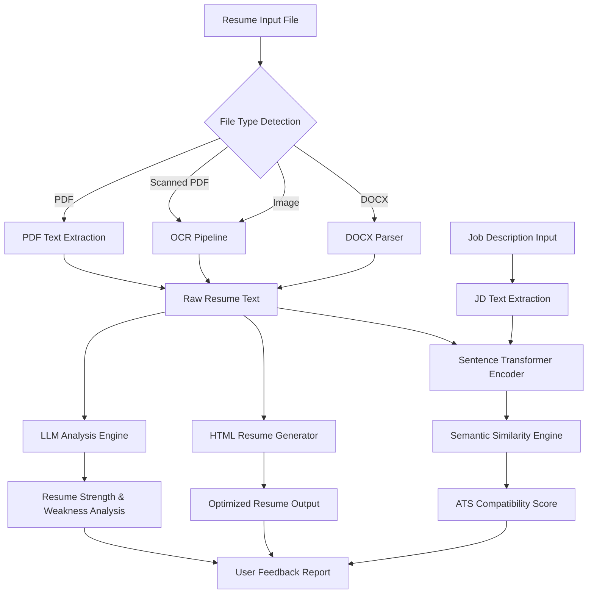

# ATSBoost
### Intelligent Resume Optimization for Applicant Tracking Systems

ATSBoost is an NLP-powered resume optimization engine designed to improve compatibility with Applicant Tracking Systems (ATS).  
The system analyzes unstructured resumes, extracts key entities using semantic parsing, and reconstructs optimized, ATS-friendly documents with improved keyword alignment and structural clarity.

---

# Overview

Modern recruitment pipelines rely heavily on automated ATS parsers that filter resumes before human review.  
ATSBoost bridges the gap between human-written resumes and machine parsing logic by applying **natural language processing, heuristic analysis, and structured document synthesis**.

The platform processes resumes through a multi-stage pipeline that extracts relevant professional information and restructures it to maximize ATS parsing accuracy.

---

# Key Features

- **Semantic Resume Parsing**  
  Extracts skills, entities, and technical competencies using NLP pipelines.

- **ATS Compatibility Analysis**  
  Evaluates keyword alignment and structural integrity for ATS systems.

- **Automated Resume Optimization**  
  Reconstructs resume content to improve readability and machine parsing.

- **LaTeX Resume Generation**  
  Generates clean, professional LaTeX-based resume templates.

- **Heuristic Scoring Engine**  
  Uses LLM-assisted analysis to score resume effectiveness.

---

# System Architecture

The ATSBoost pipeline processes resumes through a multi-stage intelligent analysis workflow combining document parsing, NLP embeddings, and LLM-based reasoning.



---

# Pipeline Explanation

### 1. Document Ingestion
The system accepts resumes in multiple formats including:

- PDF
- Scanned PDF
- Images
- DOCX

File types are detected using **python-magic**.

---

### 2. Text Extraction Layer

Different extraction pipelines are used depending on file format:

| File Type | Method |
|------|------|
| PDF | pdfplumber |
| Scanned PDF | pdf2image + Tesseract OCR |
| Image | pytesseract |
| DOCX | python-docx |

This stage produces **clean raw resume text**.

---

### 3. LLM Analysis Engine

The extracted text is sent to **Gemini 2.0 Flash** via LangChain.

The LLM performs:

- Resume strengths analysis
- Weakness detection
- Missing section detection
- Wording improvement suggestions

The output is structured JSON for further processing.

---

### 4. Resume Reconstruction

The LLM also generates an **optimized HTML resume** with:

- improved phrasing
- structured sections
- professional formatting
- ATS-friendly layout

---

### 5. ATS Compatibility Scoring

The system evaluates resume-job alignment using **Sentence Transformers**.

Models used:

- `msmarco-distilbert-base-tas-b`
- `all-MiniLM-L6-v2`

Cosine similarity is computed between:

```
Resume Embedding
Job Description Embedding
```

A weighted similarity score produces the **final ATS compatibility score**.

---

### 6. Output Layer

The system returns:

- ATS Score
- Resume analysis report
- Improved HTML resume
# Tech Stack

| Component | Technology |
|--------|--------|
| Backend | Python |
| Web Framework | Flask |
| NLP Engine | Spacy |
| Document Parsing | PDFMiner |
| Resume Templates | LaTeX |
| API Integration | LLM API |
| Frontend | React |

---

# Project Structure

```
ATSBoost/
│
├── backend/              # Flask backend & NLP logic
│   ├── main.py
│   └── services/
│
├── frontend/             # React UI
│   └── src/
│
├── .env.example          # Environment variable template
├── .gitignore
└── README.md
```

---

# Environment Setup

Create the environment file:

```
cp .env.example .env
```

Edit `.env` and add your API key:

```
API_KEY=your_api_key_here
```

---

# Installation

### Backend

```
cd backend

python -m venv venv

# Linux / Mac
source venv/bin/activate

# Windows
venv\Scripts\activate

pip install -r requirements.txt
python main.py
```

---

### Frontend

```
cd frontend
npm install
npm run dev
```

---

# Example Workflow

1. Upload resume (PDF)
2. System extracts document structure
3. NLP engine detects entities and skills
4. ATS heuristics evaluate keyword relevance
5. Resume is reconstructed in optimized LaTeX format
6. User downloads ATS-friendly resume

---

# Future Improvements

- Vector similarity search for job description matching
- Resume-job compatibility scoring
- Automated skill gap detection
- Multi-language resume support
- Resume benchmarking against industry datasets

---

# Author

**Pranjal Kumar**  
