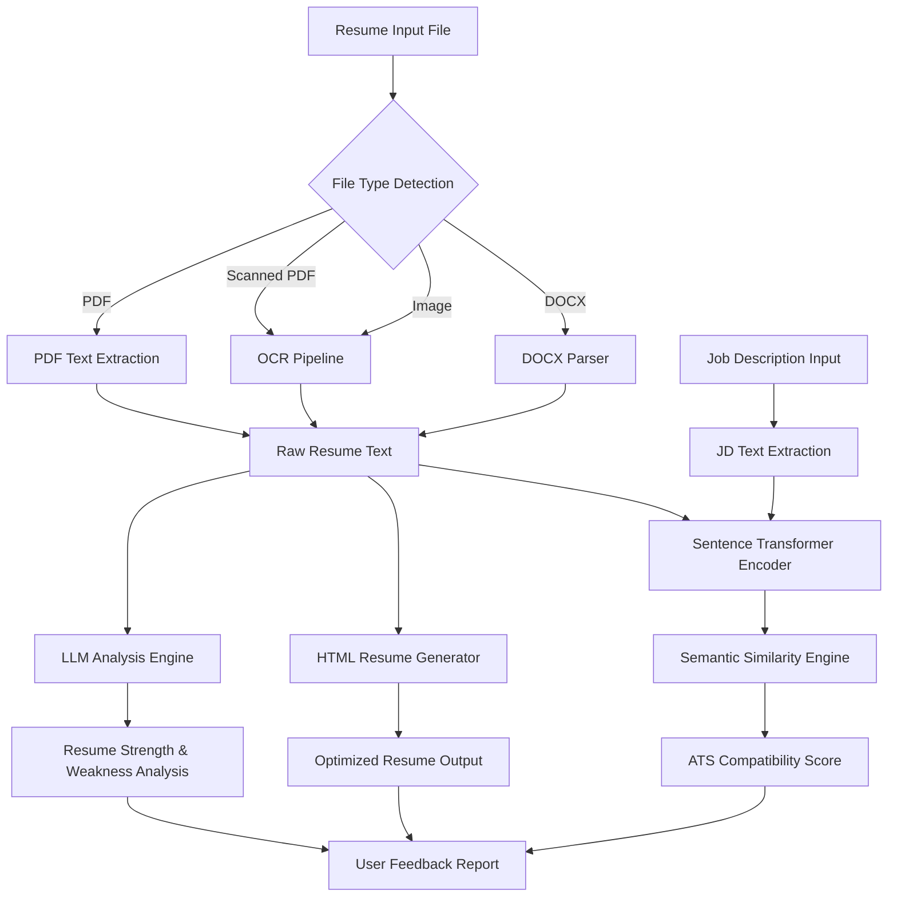

# ATSBoost
### Intelligent Resume Optimization for Applicant Tracking Systems

ATSBoost is an NLP-powered resume optimization engine designed to improve compatibility with Applicant Tracking Systems (ATS).  
The system analyzes unstructured resumes, extracts key entities using semantic parsing, and reconstructs optimized, ATS-friendly documents with improved keyword alignment and structural clarity.

---

# Overview

Modern recruitment pipelines rely heavily on automated ATS parsers that filter resumes before human review.  
ATSBoost bridges the gap between human-written resumes and machine parsing logic by applying **natural language processing, semantic embedding analysis, and structured document synthesis**.

The platform processes resumes through a multi-stage pipeline that extracts relevant professional information and restructures it to maximize ATS parsing accuracy.

---

# Key Features

- **Semantic Resume Parsing**  
  Extracts text, entities, and technical competencies across multiple document formats.

- **Dual-Model ATS Compatibility Scoring**  
  Computes dense semantic embeddings using Sentence Transformers to evaluate resume-job description alignment.

- **OCR for Scanned & Image Resumes**  
  Automatically detects scanned PDFs or image uploads and applies optical character recognition fallback.

- **LLM-Driven Qualitative Audit**  
  Uses Google Gemini 2.0 Flash via LangChain to identify strengths, weaknesses, formatting gaps, and missing keywords.

- **Dynamic HTML Resume Builder & PDF Export**  
  Reconstructs structured, ATS-compliant resume layouts with client-side PDF export.

---

# System Architecture

The ATSBoost pipeline processes resumes through a multi-stage intelligent analysis workflow combining document parsing, NLP embeddings, and LLM-based reasoning.


```mermaid
graph TD

A[Resume Input File] --> B{File Type Detection}

B -->|PDF| C[PDF Text Extraction]
B -->|Scanned PDF| D[OCR Pipeline]
B -->|Image| D
B -->|DOCX| E[DOCX Parser]

C --> F[Raw Resume Text]
D --> F
E --> F

G[Job Description Input] --> H[JD Text Extraction]

F --> I[LLM Analysis Engine]
I --> J[Resume Strength & Weakness Analysis]

F --> K[HTML Resume Generator]
K --> L[Optimized Resume Output]

F --> M[Sentence Transformer Encoder]
H --> M

M --> N[Semantic Similarity Engine]
N --> O[ATS Compatibility Score]

J --> P[User Feedback Report]
L --> P
O --> P
```

---

# Pipeline Explanation

### 1. Document Ingestion & File Type Detection
The system accepts resumes in multiple formats:
- Native PDF
- Scanned PDF
- Images (`.png`, `.jpg`, `.jpeg`, `.tiff`)
- DOCX (`.docx`)

File types and binary signatures are verified using **python-magic**. Scanned PDFs are distinguished from selectable PDFs by inspecting internal text streams using **PyMuPDF (`fitz`)**.

---

### 2. Text Extraction Layer

Specialized extraction pipelines are used depending on the file format:

| File Type | Method / Tool |
|---|---|
| Native PDF | PyMuPDF (`fitz`) |
| Scanned PDF | PyMuPDF + Tesseract OCR (`pytesseract`) |
| Image | Pillow (`PIL`) + Tesseract OCR (`pytesseract`) |
| DOCX | `python-docx` |

This stage produces **clean, unified raw resume text**.

---

### 3. LLM Analysis Engine

The extracted text is analyzed by **Google Gemini 2.0 Flash** via LangChain (`ChatGoogleGenerativeAI`).

The LLM performs:
- Identification of resume strengths and high-impact achievements
- Detection of weaknesses and vague bullet points
- Extraction of missing keywords relative to the target domain
- Action verb and measurable outcome enhancement suggestions

---

### 4. Resume Reconstruction & PDF Export

The engine generates an **optimized, ATS-compliant HTML structure** featuring:
- Clean, parseable semantic hierarchy
- Standardized section headers (Experience, Education, Skills, Projects)
- Improved phrasing and formatting
- High-fidelity client-side PDF export via `html2canvas` and `jsPDF`

---

### 5. ATS Compatibility Scoring

The system evaluates resume-job alignment using **Sentence Transformers** (`all-mpnet-base-v2`).

Cosine similarity is computed across dense vector representations:

```
Resume Embedding  <─── Cosine Similarity ───>  Job Description Embedding
```

A weighted scoring calculation generates the **final ATS compatibility score (0–100%)**.

---

### 6. Output Layer

The user interface renders a consolidated report containing:
- Interactive ATS Score Gauge
- Qualitative Feedback (Strengths, Weaknesses, Missing Skills)
- Editable, ATS-optimized Resume Preview & PDF Download

---

# Tech Stack

| Component | Technology |
|---|---|
| Backend Framework | Python, Flask, Flask-CORS |
| Database | MongoDB (`Flask-PyMongo`) |
| Authentication | JWT (`PyJWT`), Werkzeug |
| Document Parsing & OCR | PyMuPDF (`fitz`), `python-docx`, `python-magic`, `pytesseract`, `Pillow` |
| NLP & Embeddings | `sentence-transformers`, `spaCy`, `scikit-learn` |
| LLM Integration | Google Gemini 2.0 Flash (`langchain-google-genai`) |
| Email Service | `Flask-Mail` |
| Frontend UI | React 18, Vite, React Router, Axios, `react-dropzone` |
| PDF Generation | `jsPDF`, `html2canvas` |

---

# Project Structure

```
resume_build/
├── backend/
│   ├── app/
│   │   ├── models/
│   │   │   └── db_models.py       # MongoDB database client & models
│   │   ├── routes/
│   │   │   ├── api.py             # ATS scoring, parsing & analysis routes
│   │   │   └── user.py            # Authentication & user profile management
│   │   ├── services/
│   │   │   └── ATS_Engine.py      # Core parsing, OCR, similarity & LLM logic
│   │   ├── utils/
│   │   │   └── jwt_required.py    # JWT authentication decorator
│   │   ├── config.py              # Application configuration
│   │   └── __init__.py            # Flask app factory
│   ├── main.py                    # Server entry point with CORS setup
│   ├── requirements.txt           # Backend dependencies
│   └── .env.example               # Environment variables template
│
├── frontend/
│   ├── src/
│   │   ├── components/            # Reusable UI components (Dropzone, ScoreGauge, etc.)
│   │   ├── pages/                 # Home, Login, Register, Score, Resume
│   │   ├── routes/                # Application routing
│   │   ├── styles/                # CSS modules
│   │   ├── App.jsx                # Root component
│   │   └── main.jsx               # Entry DOM render
│   ├── package.json               # Frontend dependencies
│   ├── vite.config.js             # Vite configuration
│   └── index.html                 # HTML template
│
├── .gitignore
└── README.md
```

---

# Environment Setup

Navigate to the `backend/` directory and configure environment variables:

```bash
cd backend
cp .env.example .env
```

Configure the following variables in `.env`:

```env
MONGO_URI=your_mongodb_connection_uri
SECRET_KEY=your_jwt_secret_key
GOOGLE_API_KEY=your_google_gemini_api_key
MAIL_SERVER=smtp.gmail.com
MAIL_PORT=587
MAIL_USE_TLS=True
MAIL_USERNAME=your_email@gmail.com
MAIL_PASSWORD=your_app_password
```

---

# Installation & Running

### 1. Backend Setup

```bash
cd backend

# Create and activate virtual environment
python -m venv venv

# Linux / macOS
source venv/bin/activate

# Windows
venv\Scripts\activate

# Install dependencies and download spaCy model
pip install -r requirements.txt
python -m spacy download en_core_web_sm

# Start the Flask API
python main.py
```

### 2. Frontend Setup

```bash
cd frontend

# Install packages
npm install

# Run Vite dev server
npm run dev
```

---

# Example Workflow

1. **Upload Resume & JD:** User uploads resume (PDF/DOCX/Image) and provides target Job Description.
2. **Type Detection & Text Extraction:** Format is identified, and text is parsed natively or through the OCR pipeline.
3. **Similarity Scoring:** Sentence Transformer calculates multi-vector semantic match percentage.
4. **LLM Evaluation:** Gemini 2.0 Flash audits resume content for keyword alignment, formatting, and structural impact.
5. **Reconstruction & Export:** An optimized, ATS-compliant resume layout is generated with instant PDF download.

---

# Future Improvements

- Custom role-specific ATS threshold presets (e.g., Tech, Finance, Healthcare)
- Multi-language resume parsing and localization
- Real-time LaTeX template toggle alongside HTML/CSS renderer
- Industry resume benchmarking datasets

---

# Author

**[Pranjal Kumar](https://github.com/sleepy-x-dev)**
